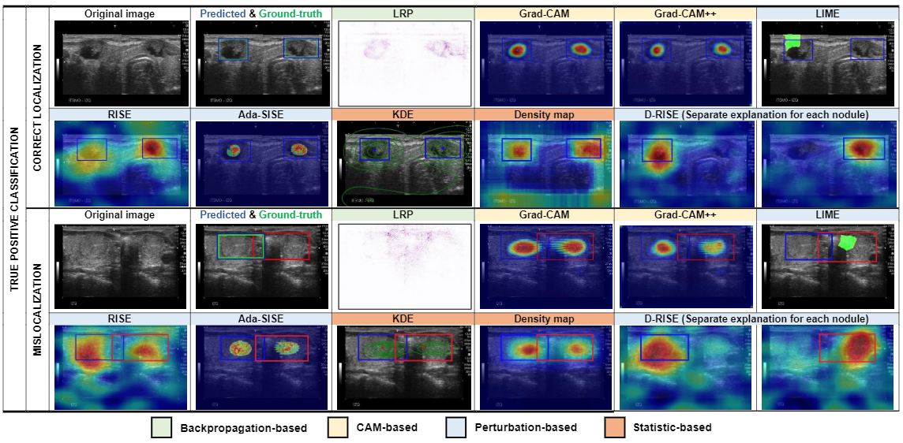

# XAI Thyroid #

## Source code for XAI Thyroid - an XAI object detection problem ##

1. **Install environment**

```
pip install -r requirements.txt
```

- Download the model at: https://drive.google.com/file/d/1IOyom78mexC6BPq4gPkfFLg-3vPzBnnO/view?usp=sharing

Move the model to ``model/src/`` folder.

2. **Instruct the parameters to be run with each algorithm**

```
python main.py --help
```

3. **Command line example with algorithms**
   Arguments options:

- `--config-path`: path to the configuration file
- `--method`: XAI method to run (options: eLRP, GradCAM, GradCAM++, RISE, LIME, DRISE, KDE, DensityMap, AdaSISE)
- `--image-path`: path to the image to be processed
- `--stage`: stage of the algorithm to be run (options: first_stage, second_stage, default: first_stage)
- `--threshold`: threshold of output values to visualize
- `--output-path`: path to the output directory

For example, to run the XAI algorithms on images in test_images folder:

- **GradCAM**

In first stage:

``` 
python main.py --config-path xAI_config.json --method GradCAM --image-path data/test_images/ --output-path results/
```

In second stage:

```
python main.py --config-path xAI_config.json --method GradCAM --image-path data/test_images/ --stage second_stage --output-path results/
```

- **GradCAM++**

In first stage:

```
python main.py --config-path xAI_config.json --method GradCAM++ --image-path data/test_images/ --output-path results/
```

In second stage:

```
python main.py --config-path xAI_config.json --method GradCAM++ --image-path data/test_images/ --stage second_stage --output-path results/

```

**Note:** To change input, change the path to new data and path to xml file in xAI_config.json

